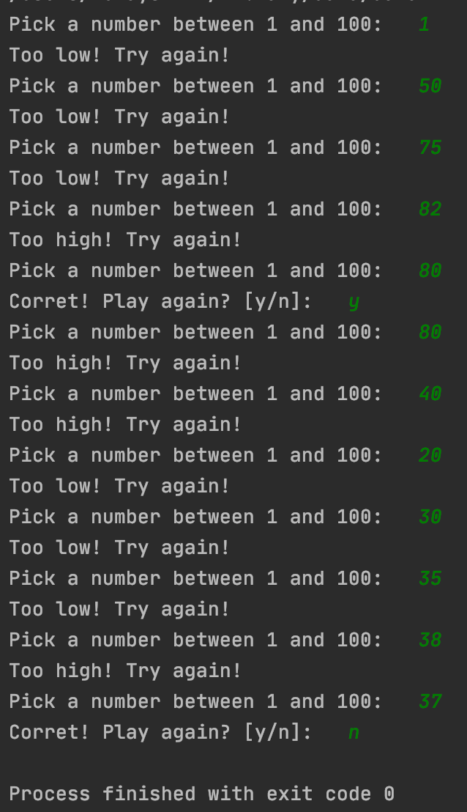

# Description
This game is off the classic flappy bird game. It's a replica and interacts similar to the mobile version of flappy bird. It keeps score and Generates random pipes to fly through.

# Development Environment
* IntelliJ
* JDK 15

# Execution
click "run" button

# Useful Sites
* [Stack Overflow](https://stackoverflow.com)
* [Kotlin Basic](https://www.programiz.com/kotlin-programming/input-output)
